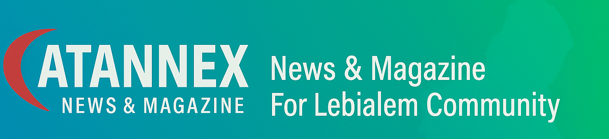

# 

## *Overview*

Atannex is a comprehensive digital platform dedicated to the Lebialem community across the globe. Our mission is to celebrate, promote, and preserve Lebialem culture, heritage, and identity by providing an engaging, centralized hub for cultural content, community news, and real-time updates. Atannex aims to empower Lebialem individuals and organizations by fostering cultural pride, facilitating communication, and supporting community-driven initiatives.

## *Purpose and Vision*

Lebialem boasts a rich history and diverse cultural heritage that spans centuries, with a vibrant diaspora scattered worldwide. Atannex was created to bridge geographical distances and cultural divides by offering a modern, accessible, and dynamic platform where Lebialem culture can be showcased, preserved, and shared.

Our vision is to become the leading online destination for Lebialem culture and community engagement — connecting generations and generations of Lebialem people through shared stories, news, and cultural expressions.

## *Core Features*

- **In-depth Cultural Content:**  
  Articles, interviews, documentaries, and multimedia presentations that highlight Lebialem traditions, folklore, cuisine, music, art, literature, and contemporary cultural trends.

- **Latest News & Community Updates:**  
  Curated, verified, and timely news covering political developments, social issues, diaspora achievements, and cultural initiatives relevant to Lebialem communities locally and abroad.

- **Event Listings & Cultural Calendar:**  
  A comprehensive and regularly updated directory of cultural festivals, exhibitions, workshops, webinars, and social events designed to bring the Lebialem community together and promote active participation.

- **Resource Center:**  
  A carefully curated collection of links and contacts for Lebialem organizations, educational institutions, cultural centers, NGOs, and support networks that serve the community’s needs.

- **Interactive Community Engagement:**  
  Features enabling members to contribute articles, share stories, announce events, and collaborate on cultural projects, fostering a vibrant and inclusive digital community.

- **Multilingual Support:**  
  Content offered primarily in Arabic and English to ensure accessibility and inclusivity across diverse Lebialem demographics worldwide.

## *Target Audience*

- **Lebialem Diaspora:** Individuals and families living outside Lebialem seeking to stay connected to their roots and heritage.  
- **Cultural Enthusiasts & Scholars:** Researchers, students, and anyone interested in Lebialem culture and Middle Eastern heritage.  
- **Community Organizations:** NGOs, cultural institutions, and social groups working to promote Lebialem culture and support Lebialem communities worldwide.  
- **General Public:** Anyone interested in learning about Lebialem culture, current affairs, and community developments.

## *Why Choose Atannex?*

In an era of globalization and digital connectivity, cultural identity remains paramount for diasporic communities. Atannex fills a critical gap by offering a trustworthy, well-curated, and culturally rich platform tailored specifically for Lebialem people globally.

- **Authenticity & Quality:** All content is carefully researched and vetted to ensure accuracy and respect for Lebialem heritage.  
- **Community-Centric:** Designed with community input and engagement as a foundational principle.  
- **Dynamic & Evolving:** Continuously updated with fresh content, interactive features, and relevant news to keep the community informed and engaged.  
- **Inclusive & Accessible:** Multilingual support and user-friendly design ensure broad accessibility.

## *Getting Started*

Explore Atannex to discover rich cultural narratives, breaking news, and upcoming community events. Subscribe to our newsletter for regular updates and follow our social media channels to join the conversation and connect with fellow Lebialem worldwide.

---

### *Contact & Partnerships*

For inquiries, collaborations, or media requests, please reach out to:  
*[atannex.info@gmail.com]*

---

*Atannex – Connecting Lebialem hearts, minds, and cultures through shared heritage and timely insight.*
